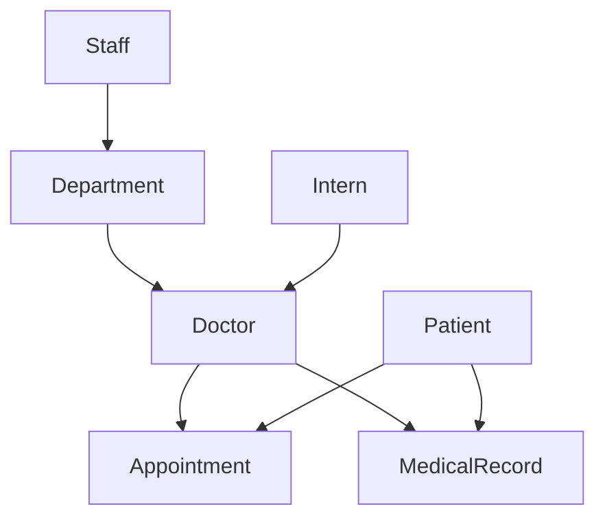

# Hospital Management System 🏥

## Overview

A robust Django-based hospital management system designed for efficient healthcare administration. This system provides comprehensive tools for managing medical staff, patients, appointments, and clinical records.


---

## 📋 Core Features

- **Staff Management**: Comprehensive tracking of doctors, nurses, and administrative staff
- **Patient Care**: Complete patient history and medical records
- **Appointment System**: Efficient scheduling and management
- **Department Organization**: Structured department hierarchy and management
- **Resource Tracking**: Lab tests, reports, and medical documentation

---

## 🏗 Architecture

### Primary Models

#### 👨‍⚕️ Medical Staff
| Model | Description |
|-------|-------------|
| `Doctor` | Specialists with department assignments and availability tracking |
| `Intern` | Training medical staff with mentor assignments |
| `Staff` | Administrative and support personnel |
| `NonStaff` | Temporary personnel and visitors |

#### 👤 Patient Care
| Model | Description |
|-------|-------------|
| `Patient` | Comprehensive patient information and history |
| `MedicalRecord` | Detailed visit documentation and treatment plans |
| `Appointment` | Scheduling and visit management |

#### 🏢 Administrative
| Model | Description |
|-------|-------------|
| `Department` | Organizational units with research focus |
| `LabTest` | Diagnostic test tracking |
| `Report` | Medical documentation and file management |

---

## 💾 Data Structure

### Key Relationships



### Security Features

- Role-based access control
- Encrypted sensitive data
- Audit logging
- HIPAA compliance measures

---

## 🔧 Technical Specifications

### Requirements

- Django 4.x+
- Python 3.8+
- PostgreSQL/MySQL
- Pillow for image processing

### Key Dependencies

```python
django>=4.0.0
pillow>=9.0.0
django-crispy-forms>=2.0
```

---

## 📁 Model Details

### Doctor Model
- Professional credentials
- Specialization tracking
- Department affiliation
- Availability management

### Patient Model
- Medical history
- Insurance information
- Emergency contacts
- Treatment tracking

### Department Model
- Research specializations
- Staff management
- Resource allocation
- Contact information

### Medical Records
- Visit documentation
- Treatment plans
- Test results
- Prescription tracking

---

## 🔐 Security Implementation

- Data encryption at rest
- Secure file storage
- Access control matrices
- Activity logging
- Regular security audits

---

## 📈 Performance Considerations

- Optimized database queries
- Efficient file handling
- Caching implementations
- Scalable architecture

---

## 🤝 Contributing

Please refer to [CONTRIBUTING.md](CONTRIBUTING.md) for detailed contribution guidelines.

---

## 📄 License

This project is licensed under the MIT License - see the [LICENSE.md](LICENSE.md) file for details.